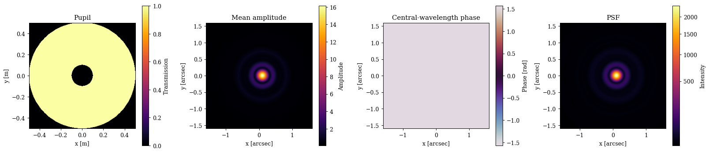
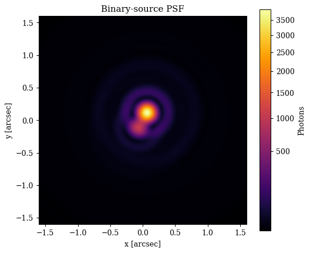
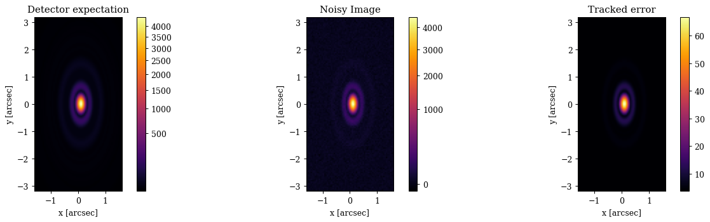

# Optical Systems, Sources, and Detectors

This tutorial follows a model through the three high-level dLux contracts. An `OpticalSystem` propagates a `Source` into a continuous `PSF`; a `DetectorSystem` samples that PSF into an `Image`. Along the way we will inspect the underlying `Wavefront`, `PSF`, and `Image` objects.


```python
import jax.numpy as np
import jax.random as jr

import dLux as dl
import dLux.utils as dlu

import matplotlib.pyplot as plt
from matplotlib.colors import PowerNorm

%matplotlib inline
plt.rcParams["image.cmap"] = "inferno"
plt.rcParams["image.origin"] = "lower"
plt.rcParams["font.family"] = "serif"
plt.rcParams["figure.dpi"] = 90
```

## Building an optical system

An `OpticalSystem` is an ordered collection of optical layers plus the `GridSpec` used to initialise its input wavefront. Propagation to another plane is explicit: here the final `Fraunhofer` layer maps the metre-sampled pupil onto an angular focal-plane grid.


```python
# Pupil and focal-plane sampling
wf_npix = 256
diameter = 1.0
oversample = 2
psf_npix = 64
psf_pixel_scale = 0.05

pupil_spec = dl.GridSpec(n=(wf_npix,) * 2, diam=diameter, unit="m")
psf_spec = dl.GridSpec(
    n=(psf_npix * oversample,) * 2,
    d=psf_pixel_scale / oversample,
    unit="arcsec",
)

# A simple obscured pupil
coordinates = pupil_spec.coordinates
primary = dlu.circle(coordinates, diameter)
secondary = dlu.circle(coordinates, 0.2 * diameter, invert=True)
aperture = primary * secondary

# Optical layers are applied in their listed order
layers = [
    ("pupil", dl.Optic(transmission=aperture, normalise=True)),
    ("propagator", dl.Fraunhofer(psf_spec)),
]
optics = dl.OpticalSystem(layers, pupil_spec)
print(optics)
```

    OpticalSystem(
      layers={
        'pupil':
        Optic(opd=None, phase=None, transmission=f32[256,256], normalise=True),
        'propagator':
        Fraunhofer(
          spec=GridSpec(n=(128, 128), d=f32[2], c=None, unit='arcsec'),
          focal_length=None,
          method='mft'
        )
      },
      spec=GridSpec(n=(256, 256), d=f32[2], c=None, unit='m')
    )


## Sources and spectra

A `Spectrum` contains wavelength samples and their corresponding weights. A `Source`
adds position, flux, and an optional resolved distribution. Units are declared once
on the source, so the user-facing values can remain in convenient units. Explicit
array weights are treated as pre-integrated and are not automatically normalised.
Parametric spectral models such as `SpectralPolynomial`, `SpectralBasis`, and
`Blackbody` provide a `normalise` option and use unit-sum weights by default. This
normalisation treats samples as equally weighted bins; nonuniform wavelength samples
require explicit bin widths or quadrature weights for a physical spectral integral.
Normalization is applied independently along the trailing wavelength axis for every
leading source or batch element. Realized weights must be positive with a finite,
non-zero sum.


```python
# A mildly red spectrum sampled in nanometres
wavelengths = np.linspace(850, 1050, 9)
weights = np.linspace(0.6, 1.4, wavelengths.size)
weights /= weights.sum()

# A point source 100 mas off axis with 2e5 photons
source = dl.Source(
    wavelengths,
    position=np.array([100.0, 0.0]),
    flux=2e5,
    weights=weights,
    units={"wavelengths": "nm", "position": "mas"},
)
print(source)
```

    Source(
      wavelengths=f32[9],
      weights=f32[9],
      units={
        'wavelengths': 'nm',
        'position': 'mas',
        'flux': 'photon',
        'distribution': 'linear'
      },
      flux=f32[],
      distribution=None,
      position=f32[2]
    )


## Wavefront and PSF states

`source.wavefront(spec)` constructs the incident field directly from the source spectrum, flux, and position. It is useful for custom wavefront workflows; any later normalising optical layer will intentionally reset its power. Resolved source distributions remain image-plane operations in `source.model`. `OpticalSystem.model` returns a `PSF` by default, while `return_all=True` also exposes the final chromatic `Wavefront`. The wavefront retains the complex electric field for every wavelength; the PSF contains their weighted intensity sum and its focal-plane sampling.


```python
input_wavefront = source.wavefront(pupil_spec)
result = optics.model(source, return_all=True)
wavefront = result["Wavefront"]
psf = result["PSF"]

print(input_wavefront)
print(wavefront)
print(psf)
print("Wavefront phasor:", wavefront.phasor.shape)
print("PSF data:", psf.data.shape)
```

    Wavefront(
      spec=GridSpec(n=(256, 256), d=f32[2], c=None, unit='m'),
      phasor=c64[9,256,256],
      wavelength=f32[9]
    )
    Wavefront(
      spec=GridSpec(n=(128, 128), d=f32[2], c=None, unit='arcsec'),
      phasor=c64[9,128,128],
      wavelength=f32[9]
    )
    PSF(
      spec=GridSpec(n=(128, 128), d=f32[2], c=None, unit='arcsec'),
      data=f32[128,128]
    )
    Wavefront phasor: (9, 128, 128)
    PSF data: (128, 128)


??? info "Plotting code"
    ```python
    pupil_extent = pupil_spec.extent
    psf_extent = psf_spec.set(unit=None).extent
    
    fig, axes = plt.subplots(1, 4, figsize=(18, 4))
    images = [
        axes[0].imshow(aperture, extent=pupil_extent),
        axes[1].imshow(wavefront.amplitude.mean(0), extent=psf_extent),
        axes[2].imshow(wavefront.phase[4], cmap="twilight", extent=psf_extent),
        axes[3].imshow(psf.data, norm=PowerNorm(0.5), extent=psf_extent),
    ]
    titles = ["Pupil", "Mean amplitude", "Central-wavelength phase", "PSF"]
    labels = ["Transmission", "Amplitude", "Phase [rad]", "Intensity"]
    for ax, image, title, label in zip(axes, images, titles, labels):
        ax.set_title(title)
        plt.colorbar(image, ax=ax, label=label)
    axes[0].set(xlabel="x [m]", ylabel="y [m]")
    for ax in axes[1:]:
        ax.set(xlabel="x [arcsec]", ylabel="y [arcsec]")
    plt.tight_layout()
    plt.show()
    ```


    

    


A `BinarySource` uses the same spectral contract while generating two positions and their flux ratio. Its weights may be shared by both stars or have a leading two-source axis for distinct component spectra.


```python
binary_weights = np.stack((weights, weights[::-1]))
binary = dl.BinarySource(
    wavelengths,
    centre=np.zeros(2),
    separation=250.0,
    position_angle=np.deg2rad(30.0),
    contrast=4.0,
    flux=2e5,
    weights=binary_weights,
    units={"wavelengths": "nm", "position": "mas"},
)
binary_psf = optics.model(binary)
print(binary)
print(binary_psf)
```

    BinarySource(
      wavelengths=f32[9],
      weights=f32[2,9],
      units={
        'wavelengths': 'nm',
        'position': 'mas',
        'flux': 'photon',
        'distribution': 'linear'
      },
      flux=f32[],
      distribution=None,
      centre=f32[2],
      separation=f32[],
      position_angle=f32[],
      contrast=f32[]
    )
    PSF(
      spec=GridSpec(n=(128, 128), d=f32[2], c=None, unit='arcsec'),
      data=f32[128,128]
    )


??? info "Plotting code"
    ```python
    plt.figure(figsize=(6, 5))
    image = plt.imshow(binary_psf.data, norm=PowerNorm(0.5), extent=psf_extent)
    plt.colorbar(image, label="Photons")
    plt.title("Binary-source PSF")
    plt.xlabel("x [arcsec]")
    plt.ylabel("y [arcsec]")
    plt.tight_layout()
    plt.show()
    ```


    

    


## Detector systems and images

A `DetectorSystem` accepts a `PSF` and returns an `Image`. This cleanly separates continuous optical modelling from detector sampling. Here we downsample the oversampled PSF, apply jitter, and add a constant background. The resulting `Image` can then generate noise realisations and track their variance.


```python
detector = dl.DetectorSystem(
    [
        ("downsample", dl.Downsample(oversample)),
        ("jitter", dl.ApplyJitter(sigma=0.35)),
        ("background", dl.AddConstant(5.0)),
    ]
)

image = detector.model(psf)
key_poisson, key_read = jr.split(jr.key(0))
noisy = image.add_poisson_noise(key_poisson).add_read_noise(key_read, sigma=3.0)

print(detector)
print(image)
print(noisy)
```

    DetectorSystem(
      layers={
        'downsample': Downsample(n=(2,)),
        'jitter': ApplyJitter(sigma=f32[], kernel_size=9, oversample=3),
        'background': AddConstant(value=f32[])
      }
    )
    Image(
      spec=GridSpec(n=(64, 128), d=f32[2], c=None, unit='arcsec'),
      variance=None,
      read_noise=f32[],
      data=f32[128,64]
    )
    Image(
      spec=GridSpec(n=(64, 128), d=f32[2], c=None, unit='arcsec'),
      variance=f32[128,64],
      read_noise=f32[],
      data=f32[128,64]
    )


??? info "Plotting code"
    ```python
    image_extent = image.spec.set(unit=None).extent
    fig, axes = plt.subplots(1, 3, figsize=(15, 4))
    panels = [
        (image.data, "Detector expectation", PowerNorm(0.5)),
        (noisy.data, "Noisy Image", PowerNorm(0.5)),
        (noisy.error, "Tracked error", None),
    ]
    for ax, (data, title, norm) in zip(axes, panels):
        im = ax.imshow(data, extent=image_extent, norm=norm)
        plt.colorbar(im, ax=ax)
        ax.set(title=title, xlabel="x [arcsec]", ylabel="y [arcsec]")
    plt.tight_layout()
    plt.show()
    ```


    

    


## Summary

The class boundaries now mirror the physical modelling flow:

1. `Source` and `Spectrum` define incident light.
2. `OpticalSystem.model(source)` returns a continuous `PSF`.
3. `DetectorSystem.model(psf)` returns a detector-sampled `Image`.

Use `return_all=True` when access to the propagated `Wavefront` is also required.
