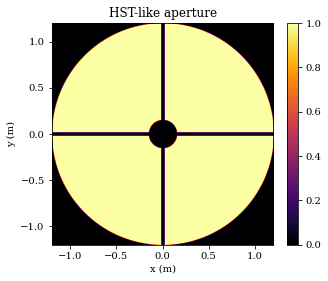
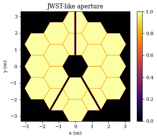
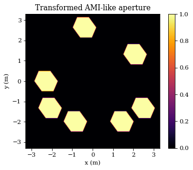
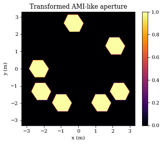

# Custom Apertures

dLux provides the tools required to let users create their own custom apertures, both static and dynamic. This tutorial will show users all the tools they need to create their own custom apertures.


```python
# Basic imports
import jax.numpy as np

# dLux imports
import dLux as dl
import dLux.utils as dlu

# Visualisation imports
import matplotlib.pyplot as plt

%matplotlib inline
plt.rcParams['image.cmap'] = 'inferno'
plt.rcParams["font.family"] = "serif"
plt.rcParams["image.origin"] = 'lower'
plt.rcParams['figure.dpi'] = 72
```

## Overview

Designed to be an inference engine, dLux provides a large amount of flexibilty for aperture creation. There are two main components: the coordinates and the shapes. Each aperture shape is calculated on a set of coordinates, which can can be transformed arbitrarily _before_ the shape is calculated. dLux implements four affine transformations, translation, rotation, compression, and shearing, however, users can implement their own transformations as well.

Let's start by looking at the tools available for creating _static_ apertures, i.e., ones that are calculated as an array of transmission values once and don't change throughout optimisation. 

## HST-like Aperture


```python
# General parameters
npix = 512
diam = 2.4 # m
oversample = 5

# Generate a set of coordinates
coords = dlu.pixel_coords(npix * oversample, diam)

# Generate outer aperture
primary = dlu.circle(coords, diam/2)

# Generate secondary mirror occultation
m2_diam = 0.305 # 30.5 cm
secondary = dlu.circle(coords, m2_diam/2, invert=True)

# Generate spiders
spider_width = 0.038 # 38 mm
angles = [0, 90, 180, 270]
spiders = dlu.spider(coords, spider_width, angles)

# Combine and downsample
aperture = dlu.combine([primary, secondary, spiders], oversample)

# Plot
extent = (-diam/2, diam/2, -diam/2, diam/2)
plt.figure(figsize=(5, 4))
plt.title("HST-like aperture")
plt.imshow(aperture, extent=extent)
plt.colorbar()
plt.xlabel("x (m)")
plt.ylabel("y (m)")
plt.show()
```


    

    


Nice and simple, now we have a nice anti-aliased static HST-like aperture that we can use in our optical model! But that was a relatively simple case, what if we want to create a more complex aperture, like a segmented aperture? Let's see how we can create our own JWST-like aperture.

## JWST-like Aperture

So what if we want to do something more complex like a JWST-like aperture? The code cell below is just some simple functions used to calculate the centers of each segment, eventually an optimised version of this will be included in dLux. Untill then, don't worry too much about the details. 


```python
# This is just some code used to calculate the hexagon centers. Down the line, an
# optimised version of this will be integrated into dLux.

def hex_cens(rmax):
    r = np.sqrt(3) * rmax
    xys = []
    for i in range(6):
        angle_rad = dlu.deg2rad(60 * i + 30)
        xy = r * np.array([np.cos(angle_rad), np.sin(angle_rad)])
        xys.append(xy)
    return np.array(xys)

def evenly_spaced_points(point1, point2, n):
    x = np.linspace(point1[0], point2[0], n+2)[1:-1]
    y = np.linspace(point1[1], point2[1], n+2)[1:-1]
    return np.squeeze(np.column_stack((x, y)))

def segmented_hex_cens(nrings, rmax, gap=0.0, has_central=False):
    rseg = rmax + (gap / np.sqrt(3))

    cens = []
    if has_central:
        cens.append(np.zeros((1, 2)))
    inner = hex_cens(rseg)
    cens.append(inner)

    for i in range(2, nrings):
        outer = hex_cens(i*rseg)
        cens.append(outer)

        mids = []
        for j in range(len(outer)):
            m = evenly_spaced_points(outer[j], outer[(j+1)%6], i - 1)
            mids.append(m)
        shaped = np.array(mids).reshape([6 * (i-1), 2])
        cens.append(shaped)
    return np.concatenate(cens)
```

Note that the code cell below can be slow (~10s for me), as the above code is not optimised, although it will be later!


```python
# General parameters
npix = 1024
diam = 6.6 # m
oversample = 3
flat_to_flat = 1.32 # m
air_gap = 0.007 # m

# Generate a set of coordinates
coords = dlu.pixel_coords(npix * oversample, diam)

# Calculate the centers of each heaxgon
rmax = flat_to_flat / np.sqrt(3)
cens = segmented_hex_cens(3, rmax, air_gap)

# Translate them to each position and calculate the hexagon
hexes = []
for cen in cens:
    coords_in = dlu.translate_coords(coords, cen)
    hexes.append(dlu.reg_polygon(coords_in, rmax, 6))

# Sum the heaxgons into a primary
primary = np.array(hexes).sum(0)

# Gerenate spiders
spider_width = 0.1 # m
angles = [180, 30, -30]
spider = dlu.spider(coords, spider_width, angles)

# Combine and downsample
aperture = dlu.combine([primary, spider])

# Plot
extent = (-diam/2, diam/2, -diam/2, diam/2)
plt.figure(figsize=(5, 4))
plt.title("JWST-like aperture")
plt.imshow(aperture, extent=extent)
plt.colorbar()
plt.xlabel("x (m)")
plt.ylabel("y (m)")
plt.show()
```


    

    


## Abstractly Transformed Apertures

Since dLux apertures are calculated anaytically on a set of coordinates, we can perform various transformations to the coordinates in order to generate abstractly shaped apertures. Let's see how we can do this.

For an example, we will look at how we can apply a _shear_ and _rotation_ to the JWST AMI mask.


```python
# General parameters
npix = 1024
diam = 6.6 # m
oversample = 3
flat_to_flat = 1. # m
air_gap = 0.32 # m

# Calculate the centers of each heaxgon
rmax = flat_to_flat / np.sqrt(3)
cens = segmented_hex_cens(3, rmax, air_gap)

# Get the AMI segments
indexes = [6, 8, 9, 10, 12, 13, 17]
cens = cens[indexes, ...]

# Generate a set of coordinates and shear them
coords = dlu.pixel_coords(npix * oversample, diam)
coords = dlu.rotate_coords(coords, np.pi)
coords = dlu.shear_coords(coords, np.array([0.15, 0.]))

# Translate them to each position and calculate the hexagon
hexes = []
for cen in cens:
    coords_in = dlu.translate_coords(coords, cen)
    hexes.append(dlu.reg_polygon(coords_in, rmax, 6))

# Combine and downsample
ami = dlu.combine(hexes, sum=True)

# Plot
extent = (-diam/2, diam/2, -diam/2, diam/2)
plt.figure(figsize=(5, 4))
plt.title("Transformed AMI-like aperture")
plt.imshow(ami, extent=extent)
plt.colorbar()
plt.xlabel("x (m)")
plt.ylabel("y (m)")
plt.show()
```


    

    


## Dynamic Apertures

As an inference engine, dLux is designed to be able to handle dynamic apertures, ie apertures that change througout the optimisation process. This is useful for calibrating mis-alignments in the optical system. The fundamentals are more or less the same as the static apertures, so let's see how we could recover a mis-aligned JWST AMI mask.


```python
# General parameters
npix = 1024
diam = 6.6 # m
oversample = 3
flat_to_flat = 1. # m
air_gap = 0.32 # m

# Calculate the centers of each heaxgon
rmax = flat_to_flat / np.sqrt(3)
cens = segmented_hex_cens(3, rmax, air_gap)

# Get the AMI segments
indexes = [6, 8, 9, 10, 12, 13, 17]
cens = cens[indexes, ...]

# Calculate the dynamic hexagonal apertures
hexes = []
for cen in cens:
    tf = dl.CoordTransform(translation=cen)
    hexes.append(dl.RegPolyAperture(6, rmax, tf))

# We want to recover the rotation and shear, so we initialise a CoordTransform object
# With a rotation and shear that we can optimise
tf = dl.CoordTransform(rotation=np.pi, shear=np.array([0.1, 0.]))

# Combine into a multi-aperture
aperture = dl.MultiAperture(hexes, tf)

# Now we calculate the transmission of the aperture
coords = dlu.pixel_coords(npix * oversample, diam)
trans = aperture.transmission(coords, diam/npix)

# Plot
extent = (-diam/2, diam/2, -diam/2, diam/2)
plt.figure(figsize=(5, 4))
plt.title("Transformed AMI-like aperture")
plt.imshow(trans, extent=extent)
plt.colorbar()
plt.xlabel("x (m)")
plt.ylabel("y (m)")
plt.show()
```


    

    


Excellent, as we can see we are able to re-create the mis-aligned JWST AMI mask. Now we can double check that everything is working correctly by calculating the gradients of this dynamic aperture (with a slightly different value for shear) wrt the static one we calculated earlier.


```python
import zodiax as zdx

params = ['transformation.rotation', 'transformation.shear']
@zdx.filter_grad(params)
def loss_fn(aperture, data):
    trans = aperture.transmission(coords, diam/npix)
    return np.sum(np.square(trans - data))

grads = loss_fn(aperture, ami)
print(grads.get(params))
```

    [Array(4586134.5, dtype=float32), Array([-4672687. ,   -70895.3], dtype=float32)]


Excellent, we now have gradients for each of the transformations, which we can use in an optimisation loop to _infer_ these values from some data.

Note that these calculations can be slow, especially for large arrays with lots of sub-apertures as the full set of coordinates must be transformed for each sub-aperture individually, and then have its transmission calculated. This is just a consequence of the need to re-calculate the aperture on an arbitrary set of coordinates in order for them to be optimised. However this is a rare-occurrence and 99% of users are unlikely to ever need this.

## Summary

This should give readers a short overview of the tools available for creating custom apertures in dLux. From here users should be able to create any aperture they need from this and the API docs.
