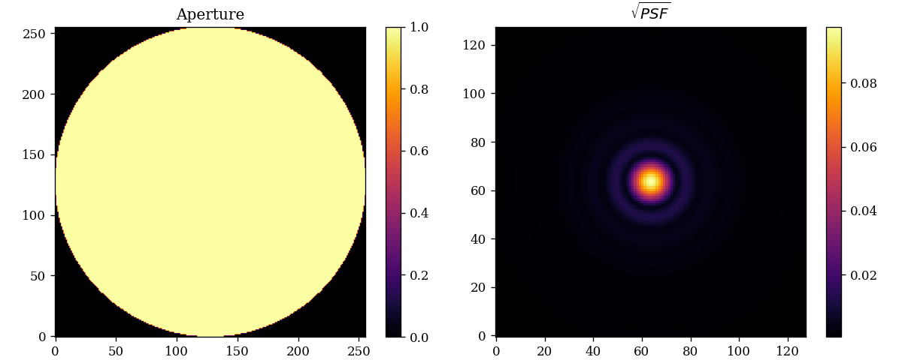
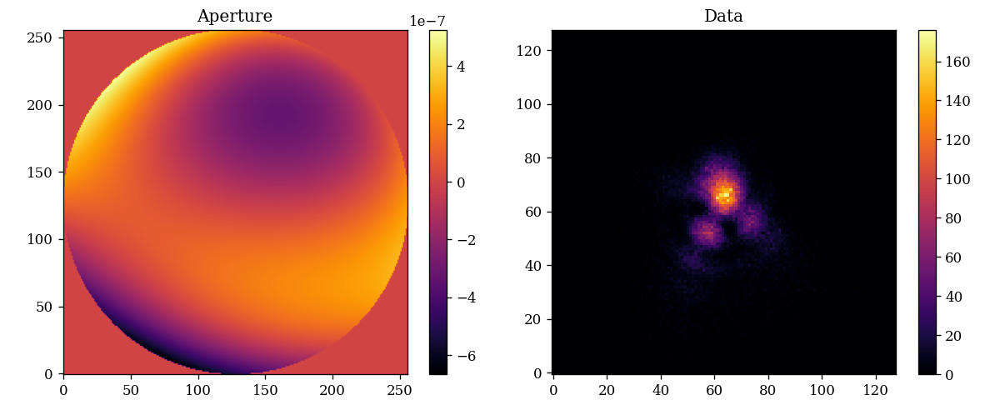
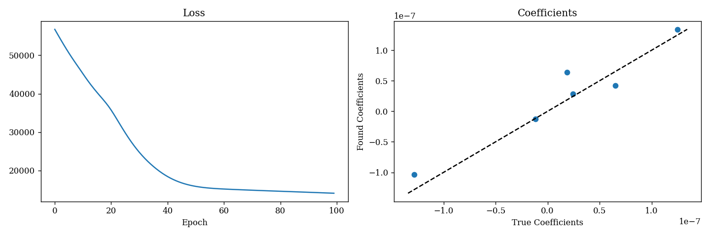
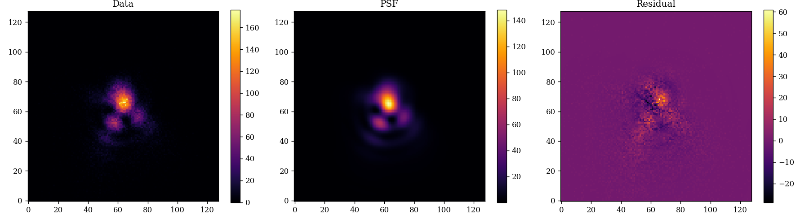
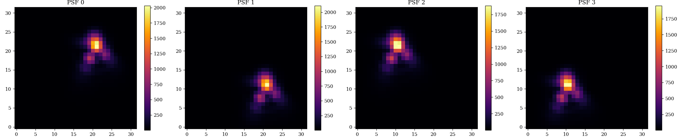

# Using ∂Lux

---

∂Lux is built in Zodiax, so users should start with the [Using Zodiax Tutorial](https://louisdesdoigts.github.io/zodiax/docs/usage/), which covers the basics of the framework and how to use the optimisation tools used in ∂Lux.

## A Simple Optical System

There are two different types of optical classes: _Layered_, and _non-Layered_.

Layered gives full control over the wavefront at each step, but non-layered objects can be simpler to work with. We will first construct a non-Layered Optics class and then a Layered Optics class.

```python
import jax.numpy as np
import dLux as dl

# Define the parameters
wf_npixels = 256
diameter = 1 # meters
psf_npixels = 128
psf_pixel_scale = 0.1 # arcseconds
psf_oversample = 4

# Use ApertureFactory class to make a simple circular aperture
aperture = dl.ApertureFactory(wf_npixels)

# Construct the optics class
optics = dl.AngularOptics(wf_npixels, diameter, aperture, 
    psf_npixels, psf_pixel_scale, psf_oversample)
```

Let's have a look at our object:

```python
print(optics)

> AngularOptics(
>   wf_npixels=256,
>   diameter=1.0,
>   aperture=Optic(opd=None, normalise=True, transmission=f32[256,256]),
>   mask=None,
>   psf_npixels=128,
>   psf_oversample=4.0,
>   psf_pixel_scale=0.1
> )
```

Now, we can simply propagate `wavelengths` through the optics like so:

```python
# Propagate the wavelengths
wavelengths = np.linspace(1e-6, 1.2e-6, 5) # metres
psf = optics.propagate(wavelengths)
```

??? abstract "Plotting Code"
    ```python
    import matplotlib.pyplot as plt
    plt.figure(figsize=(10, 4))
    plt.subplot(1, 2, 1)
    plt.title("Aperture")
    plt.imshow(optics.aperture.transmission)
    plt.colorbar()

    plt.subplot(1, 2, 2)
    plt.title("$\sqrt{PSF}$")
    plt.imshow(psf**0.5)
    plt.colorbar()
    plt.tight_layout()
    plt.savefig('assets/simple_optics.png')
    ```



Now, let's take a look at how we can create an identical optical system using the layered approach. This approach is more verbose, but gives us more control over the wavefront at each step.

```python
import jax.numpy as np
import dLux.utils as dlu
import dLux as dl

# Define the parameters
wf_npixels = 256
diameter = 1 # meters
psf_npixels = 128
psf_pixel_scale = dlu.arcsec_to_rad(0.1 / 4)

# Construct the list of layers
layers = [
    dl.ApertureFactory(wf_npixels),
    dl.MFT(psf_npixels, psf_pixel_scale)
]

# Construct the optics class
optics = dl.LayeredOptics(wf_npixels, diameter, layers)
```

Let's again look at our optics object to see how it has changed:

```python
print(optics)

> LayeredOptics(
>   wf_npixels=256,
>   diameter=1.0,
>   layers={
>     'Optic':
>     Optic(opd=None, normalise=True, transmission=f32[256,256]),
>     'MFT':
>     MFT(focal_length=None, inverse=False, npixels=128, pixel_scale=f32[])
>   }
> )
```

We use the same method to propagate the wavelengths:

```python
# Propagate the wavelengths
wavelengths = np.linspace(1e-6, 1.2e-6, 5) # meters
psf = optics.propagate(wavelengths)
```

??? abstract "Plotting Code"
    ```python
    import matplotlib.pyplot as plt
    plt.figure(figsize=(10, 4))
    plt.subplot(1, 2, 1)
    plt.title("Aperture")
    plt.imshow(optics.Optic.transmission)
    plt.colorbar()

    plt.subplot(1, 2, 2)
    plt.title("$\sqrt{PSF}$")
    plt.imshow(psf**0.5)
    plt.colorbar()
    plt.tight_layout()
    plt.savefig('assets/layered_optics.png')
    ```


---

## Basic Phase Retrieval

Now that we know how to create a simple optical system, let's see how we can take advantage of the differentiable nature of ∂Lux to perform phase retrieval. We will use the same optical system as before, but this time we will add a phase screen to the aperture.

```python
import jax.numpy as np
import jax.random as jr
import dLux as dl

# Define the parameters
wf_npixels = 256
diameter = 1 # meters
psf_npixels = 128
psf_pixel_scale = 0.1 # arcseconds
psf_oversample = 4

# Aberrations Parameters
zernikes = np.arange(4, 10)
coefficients = 1e-7 * jr.normal(jr.PRNGKey(0), zernikes.shape)

# Use ApertureFactory class to make a simple circular aperture
aperture = dl.ApertureFactory(wf_npixels, noll_indices=zernikes, 
    coefficients=coefficients)

# Construct the optics class
optics = dl.AngularOptics(wf_npixels, diameter, aperture, 
    psf_npixels, psf_pixel_scale, psf_oversample)

# Propagate the wavelengths
wavelengths = np.linspace(1e-6, 1.2e-6, 5) # meters
source = dl.PointSource(wavelengths, flux=5e4)
data = jr.poisson(jr.PRNGKey(1), optics.model(source))
```

??? abstract "Plotting Code"
    ```python
    import matplotlib.pyplot as plt
    plt.figure(figsize=(10, 4))
    plt.subplot(1, 2, 1)
    plt.title("Aberrations")
    plt.imshow(optics.aperture.opd)
    plt.colorbar()

    plt.subplot(1, 2, 2)
    plt.title("Data")
    plt.imshow(data)
    plt.colorbar()
    plt.tight_layout()
    plt.savefig('assets/aberrated_optics.png')
    ```



Now, we just need to reset our aberration coefficients to zero and define our loss function:

```python
import jax.scipy as jsp
import zodiax as zdx
import optax

# Set aberration coefficents to zero
parameter = 'aperture.coefficients'
model = optics.multiply(parameter, 0.1)

# Define the loss function
@zdx.filter_jit
@zdx.filter_value_and_grad(parameter)
def loss_fn(model, source, data):
    psf = model.model(source)
    return -np.sum(jsp.stats.poisson.logpmf(data, psf))

# Compile the loss function
loss, grads = loss_fn(model, source, data)
```

Now, we optimise in a simple loop:

```python
optim, opt_state = zdx.get_optimiser(model, parameter, optax.adam(2e-9))

losses, models_out = [], []
for i in range(100):
    # calculate the loss and gradient
    loss, grads = loss_fn(model, source, data) 
    
    # apply the update
    updates, opt_state = optim.update(grads, opt_state)
    model = zdx.apply_updates(model, updates)
    
    # save results
    models_out.append(model) 
    losses.append(loss)
```

??? abstract "Plotting Code"
    ```python
    plt.figure(figsize=(12, 4))
    plt.subplot(1, 2, 1)
    plt.title("Loss")
    plt.plot(losses)
    plt.xlabel("Epoch")

    found_coeffs = models_out[-1].aperture.coefficients
    plt.subplot(1, 2, 2)
    plt.title("Coefficients")
    plt.scatter(coefficients, found_coeffs)
    plt.xlabel("True Coefficients")
    plt.ylabel("Found Coefficients")

    # Add y=x line

    v = np.max(np.abs(np.concatenate([coefficients, found_coeffs])))
    plt.plot([-v, v], [-v, v], color='k', linestyle='--')

    plt.tight_layout()
    plt.savefig('assets/loss_curve.png')

    # Plot data. model and residual

    plt.figure(figsize=(15, 4))
    plt.subplot(1, 3, 1)
    plt.title("Data")
    plt.imshow(data)
    plt.colorbar()

    psf = models_out[-1].model(source)
    plt.subplot(1, 3, 2)
    plt.title("PSF")
    plt.imshow(psf)
    plt.colorbar()

    plt.subplot(1, 3, 3)
    plt.title("Residual")
    plt.imshow(data - psf)
    plt.colorbar()

    plt.tight_layout()
    plt.savefig('assets/recovered_model.png')
    ```





---

## Complex Optical Systems

So far we have looked at the ∂Lux basics, but there is much more functionality available! Here we will show how to model the effects of a detector with a dithered observation pattern, using the same optics and source classes we defined above.

```python
# Construct Detector Object
detector_layers = [dl.ApplyJitter(3), dl.IntegerDownsample(4)]
detector = dl.LayeredDetector(detector_layers)

# Construct Dithered Observation
dithers = 2.5e-6 * np.array([[1, 1], [1, -1], [-1, 1], [-1, -1]])
observation = dl.Dither(dithers)

# Combine all into instrument and model
instrument = dl.Instrument(optics, source, detector, observation)
psfs = instrument.observe()
```

??? abstract "Plotting Code"
    ```python
    plt.figure(figsize=(20, 4))
    for i, psf in enumerate(psfs):
        plt.subplot(1, 4, i+1)
        plt.title("PSF {}".format(i))
        plt.imshow(psf)
        plt.colorbar()
    plt.tight_layout()
    plt.savefig('assets/full_instrument.png')
    ```



This has been a quick overview of how to use ∂Lux! The next step from here would be to take a look at the rest of the tutorials, which show how to do more complex modelling and parameter recovery!